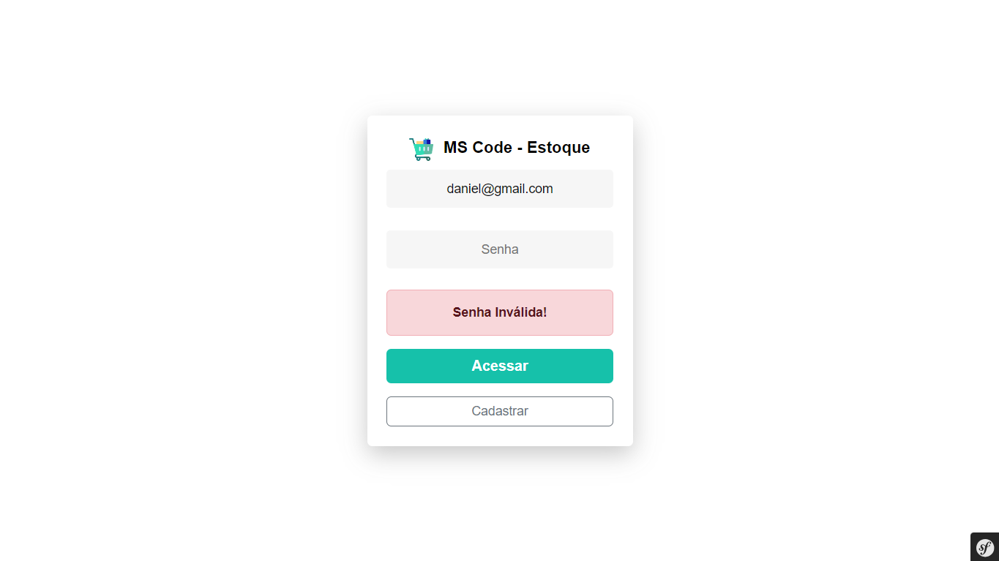

# Documentação do Projeto

O projeto **MS-CODE-ESTOQUE** é um sistema intuitivo de gerenciamento de estoque, criado com o framework **Symfony** e utilizando a arquitetura **MVC** (Model-View-Controller). Com ele, é fácil gerenciar categorias e produtos, permitindo adicionar, editar e excluir itens, além de controlar o estoque de maneira prática e eficiente.

Abaixo estão as imagens e capturas de tela relacionadas ao sistema, organizadas em seções para facilitar a navegação e compreensão das funcionalidades oferecidas.

## Login/Cadastro

### Tela de Login
  
Esta é a tela inicial onde os usuários fazem login.

### Tela de Cadastro
  
Tela onde os novos usuários se cadastram.

### Alert de Erro na Senha
  
Alert exibido quando a senha inserida está incorreta.

## Produtos

### Página Inicial de Produtos
  
Tela inicial que exibe a lista de produtos.

### Adicionar Novo Produto
  
Tela para adicionar um novo produto ao sistema.

### Alert de Sucesso ao Inserir Produto
  
Alert exibido quando um novo produto é adicionado com sucesso.

### Alert de Alerta ao Tentar Vender Produto sem Estoque
  
Se o usuário tentar vender um produto com 0 no estoque, aparecerá este alerta.

### Alert de Confirmação para Exclusão de Produto
  
Alert de confirmação para a exclusão de um produto.

### Alert de Edição de Produto
  
Alert exibido para editar as informações de um produto.

## Categoria

### Adicionar Nova Categoria
  
Tela para adicionar novas categorias ao sistema.

### Alert de Sucesso ao Adicionar Categoria
  
Alert exibido quando a nova categoria é adicionada com sucesso.

### Editar Categoria
  
Tela para editar informações de uma categoria existente.

### Alert de Sucesso ao Excluir Categoria
  
Alert exibido após a exclusão bem-sucedida de uma categoria.

## Dados de Vendas
  
Informações sobre as vendas realizadas, com armazenamento em tabela separada.

## Menu Lateral

### Informações do Usuário no Menu Lateral
  
Tela mostrando as informações do usuário no menu lateral.

---